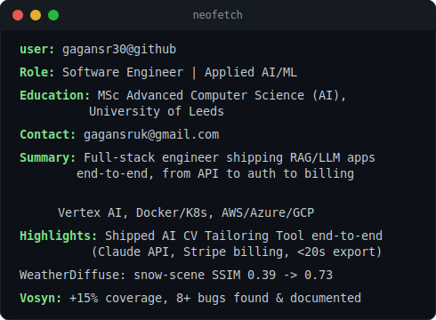

# Hi there, I'm Gagan S R :wave:

### Software Engineer | Applied AI/ML | MSc Computer Science (AI) — University of Leeds

---

### `gagan@github ~ who am i`

<table>
  <tr>
    <td valign="top"></td>
    <td valign="top"></td>
  </tr>
</table>

---

## :rocket: About Me

Software Engineer with an **MSc in Advanced Computer Science (AI)** from the University of Leeds, with experience across backend systems, REST APIs, and full-stack development. I led a global team of 20+ developers through a Java-to-Flutter conversion at GAO Tek Inc., and independently designed, built, and shipped a full-stack **AI-powered CV tailoring web app** end-to-end — covering authentication, subscription billing, and document generation. I bring growing hands-on experience with RAG and LLM pipelines from my time at Vosyn Inc., and I'm looking to bring strong engineering fundamentals plus applied AI exposure to a team building production software at scale.

- :telescope: Currently working on AI/ML pipelines, RAG systems, and LLM-powered applications
- :seedling: Growing focus on Generative AI, Diffusion Models, and Large Language Models
- :sparkles: Shipped an **AI CV Tailoring Tool** end-to-end — Claude API, Supabase/Stripe billing, ATS-aligned DOCX/PDF export in under 20s
- :briefcase: Open to full-time Software Engineering and AI/ML Engineer roles
- :round_pushpin: Based in Leeds, UK — open to relocate and  remote/hybrid opportunities

---

## :wrench: Tech Stack

### :computer: Languages

### :robot: AI / ML

### :toolbox: Frameworks and Libraries

### :cloud: Cloud and DevOps

### :floppy_disk: Databases

---

## :briefcase: Professional Experience

### :computer: Software Engineer (AI) — Vosyn Inc.
**Nov 2025 – Jan 2026 | Ontario, Canada (Remote) — Master's-level Intern**

- Supported the reliability of an enterprise FastAPI-based Retrieval-Augmented Generation (RAG) chat system (Google Vertex AI, Gemini 2.0 Flash, Cloud SQL Postgres, n8n) by writing unit tests, increasing test coverage by around **15%**
- Reviewed pipeline outputs and identified **8+ bugs** with detailed reproduction steps, helping the team resolve issues faster

---

### :computer: Software Developer Intern — GAO Tek Inc.
**Apr 2023 – Jun 2023 | NYC, USA (Remote)**

- Converted a Java codebase to **Flutter and Dart** across 8 modules for a real-time tracking and monitoring system, improving cross-platform delivery and maintainability
- Led a global team of **20+ interns** through Agile/Scrum sprints, coordinating tasks and delivery via Microsoft Teams

## :dart: Featured Projects

| Project | Description | Tech Stack |
|---------|-------------|------------|
| **[AI CV Tailoring Tool](https://cv-tailor-olive.vercel.app/)** | Full-stack CV tailoring web app integrating the Claude API under a strict no-fabrication constraint, with a tiered Supabase/Stripe subscription model and ATS-aligned DOCX/PDF export in under 20s | Claude API, Supabase, Stripe |
| **[WeatherDiffuse](https://huggingface.co/spaces/gagansr30/Rainy_Snowy_Fog_Image_Generator)** | 3-stage generative diffusion pipeline (InstructPix2Pix, physics-based augmentation via Beer-Lambert law & MiDaS v3) synthesising photorealistic fog/rain/snow imagery for the nuScenes autonomous-driving dataset; improved snow-scene SSIM from 0.39 to 0.73 | Python, PyTorch, OpenCV |
| **InciExtract** | Pipeline converting unstructured incident reports into structured JSON using zero-shot detection and LLM summarisation | Python, FastAPI, LLMs |
| **[FaceAttend](https://github.com/gagansr30/Face-Recognition-and-Attendance-Software)** | Real-time face recognition attendance system for up to 50 people, integrated with MySQL | Python, OpenCV, MySQL |
| **[PharmaSys](https://github.com/gagansr30/Pharmacy-Management-System)** | Pharmacy management system with inventory, sales, prescriptions, and automated reporting | VB 6.0, SQL Server |
| **Android Attendance App** | Android app to digitalise student attendance with real-time Firebase backend and intuitive UX | Java, Firebase, Android |

---

## :mortar_board: Education

:school: **MSc Advanced Computer Science (Artificial Intelligence) — 2.1**
University of Leeds | Sept 2024 – Nov 2025
> Modules: Machine Learning, Deep Learning, Data Science, Advanced Software Engineering, Knowledge Representation, Data Structures & Algorithms
> Research-based project: Generative Diffusion Model based environmental image synthesis

:school: **BCA: Computer Science — Distinction**
Bengaluru North University | Apr 2020 – Nov 2023
> Relevant: Data Structures, OS, C++, Java, Python, Web Programming, Database Management Systems

---

## :scroll: Certifications

| Certification | Issuer | Year |
|--------------|--------|------|
| Agile Software Development | University of Minnesota (Coursera) | 2025 |
| CS50: Introduction to Computer Science | Harvard University (edX) | 2024 |
| Software Engineering (Virtual Experience) | Goldman Sachs (Forage) | 2023 |
| Advanced Software Engineering (Virtual Experience) | Walmart Global Tech (Forage) | 2023 |
| Software Engineering Job Simulation | Skyscanner (Forage) | 2023 |

---

## :speech_balloon: Languages

English, Kannada, Telugu, Hindi

---

## :mailbox: Get In Touch

:phone: +44 7990 238113 | :pushpin: Leeds, UK

---

<i>:star: If you find my work interesting, feel free to star some repositories!</i>

